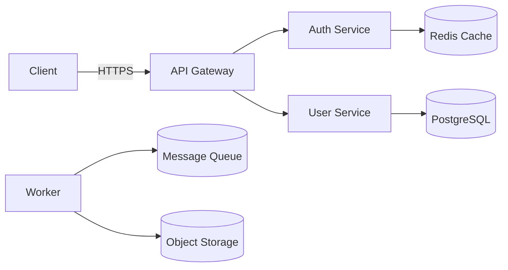

# Architecture

This document describes system boundaries, major components, data flows, integrations, and constraints.

## Goals
- Scalability, observability, security, and maintainability.

## Components
- API Gateway: ingress, routing, authentication, rate-limiting.
- Services: auth, user, billing, jobs, reporting (each service is a small, well-scoped container).
- Data stores: PostgreSQL (primary relational), Redis (cache/session), object storage (S3-compatible) for blobs.
- Background processing: worker fleet consuming from a durable queue (e.g., Kafka/RabbitMQ).
- Observability: Prometheus (metrics), Grafana (dashboards), ELK/Tempo for logs/traces.

## Data flow (high-level)
1. Client -> API Gateway (TLS, auth)
2. Gateway routes to service; services talk to databases or enqueue background jobs
3. Background workers process jobs and emit events/metrics

## Deployment
- Container images (Docker), Kubernetes for orchestration.
- Infrastructure as code: Terraform for cloud resources.
- CI/CD: build images, run tests, deploy to staging then production via automated pipelines.

## Diagrams
Embed Mermaid diagrams for component and sequence views.

Example component diagram (Mermaid):

## Constraints and trade-offs
- Prefers managed cloud services for operational simplicity.
- K8s adds operational overhead but gives scaling and isolation.

## Next steps
- Add sequence diagrams for sign-up, login, and billing flows.
