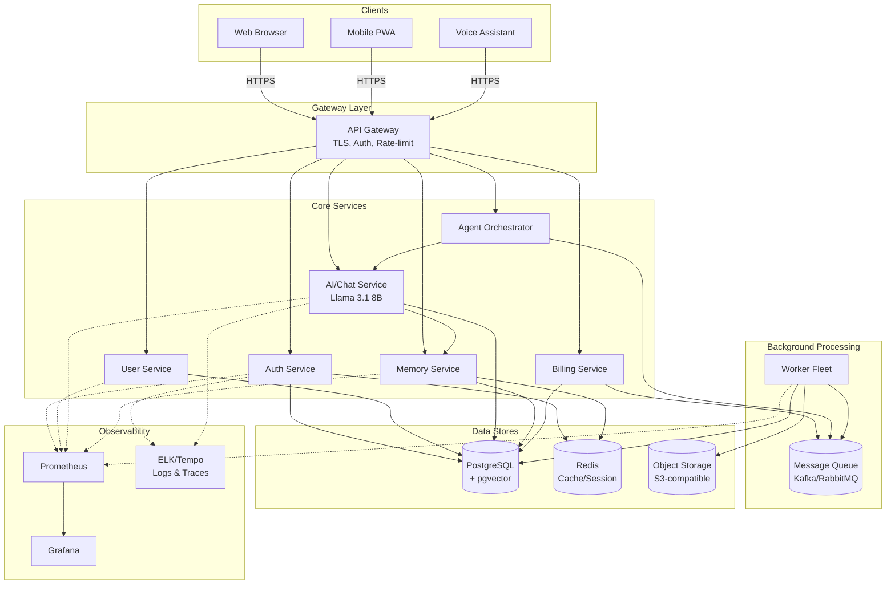
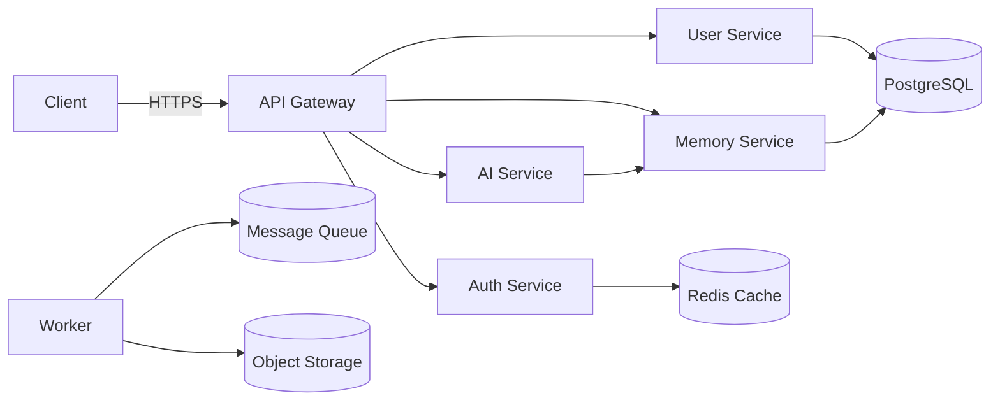
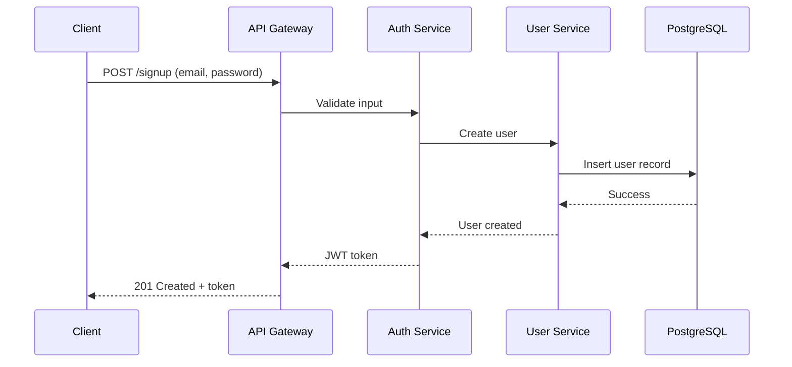
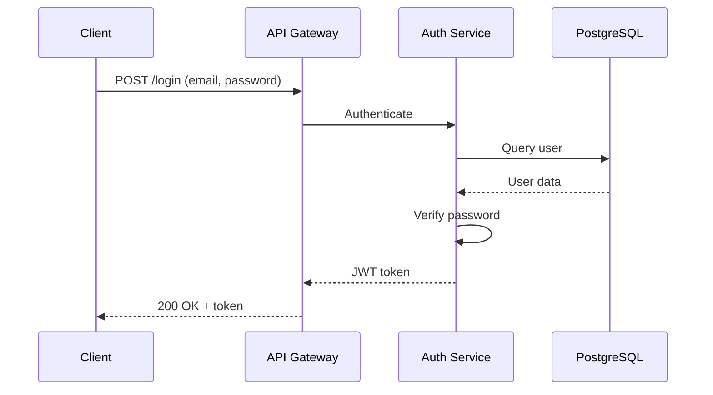
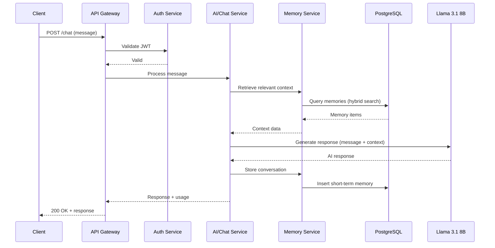
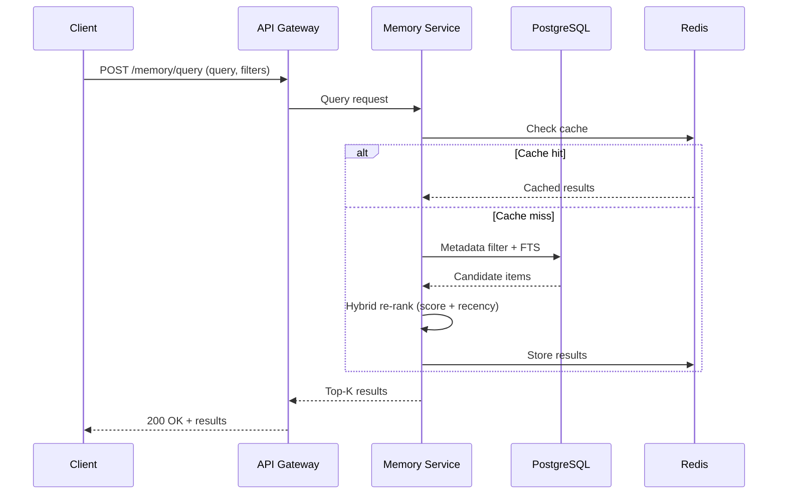
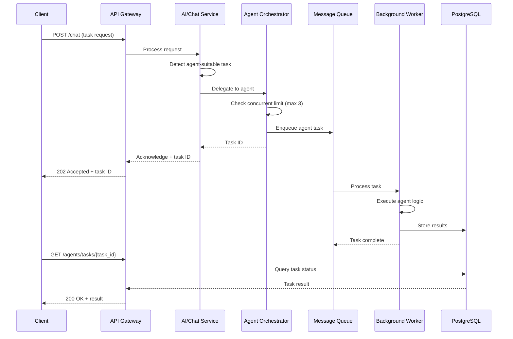
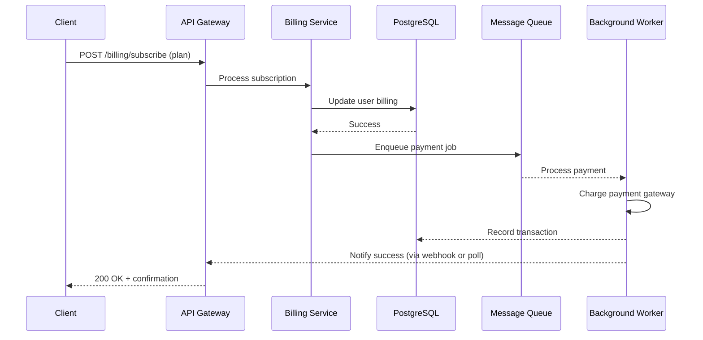
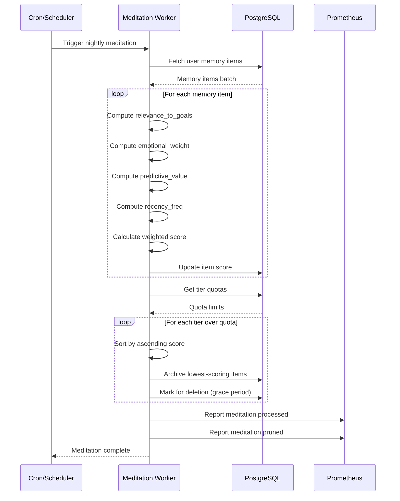

# Architecture

This document describes system boundaries, major components, data flows, integrations,
and constraints.

## Goals

- Scalability, observability, security, and maintainability.

## Components

- API Gateway: ingress, routing, authentication, rate-limiting.
- AI Service: Handles conversational AI using hybrid LLM approach - primary local
  inference with Llama 3.1 8B quantized model, API wrapper fallback for high-demand
  scenarios.
- Services: auth, user, billing, jobs, reporting (each service is a small, well-scoped
  container).
- Data stores: PostgreSQL with pgvector (primary relational + vector), Redis
  (cache/session), object storage (S3-compatible) for blobs.
- Background processing: worker fleet consuming from a durable queue (e.g.,
  Kafka/RabbitMQ).
- Observability: Prometheus (metrics), Grafana (dashboards), ELK/Tempo for logs/traces.

## Data flow (high-level)

1. Client -> API Gateway (TLS, auth)
2. Gateway routes to service; services talk to databases or enqueue background jobs
3. Background workers process jobs and emit events/metrics

## Deployment

- Container images (Docker), Kubernetes for orchestration.
- Infrastructure as code: Terraform for cloud resources.
- CI/CD: build images, run tests, deploy to staging then production via automated
  pipelines.

## Diagrams

The following Mermaid diagrams illustrate the system architecture and key data flows.

### System Component Diagram

### Simplified Data Flow

## Sequence Diagrams

### Sign-up Flow

### Login Flow

### Chat Conversation Flow

### Memory Retrieval Flow

### Agent Delegation Flow

### Billing Flow

### Memory Meditation (Nightly Scoring) Flow

## Constraints and trade-offs

- Prefers managed cloud services for operational simplicity.
- K8s adds operational overhead but gives scaling and isolation.
- Performance targets: Chat response <1s (warm model), initial model load <30s, memory
  retrieval <500ms, agent delegation <5s, meditation <10min.

## API Overview

This document provides a concise overview of the Kimberly REST API and links to the
OpenAPI definition in `docs/openapi.yaml`.

### Authentication

- JWT Bearer tokens (issued on login/signup).
- All protected endpoints require `Authorization: Bearer <token>`.

### Core endpoints (summary)

- POST /signup — create an account and receive JWT
- POST /login — authenticate and receive JWT
- POST /chat — send a message to the conversational AI
- GET /memory — list memory items
- POST /memory — add memory
- DELETE /memory/{id} — remove memory
- GET /agents — list available agents
- POST /agents/{id}/run — invoke an agent
- GET /health — service health

For full request/response details and schemas see `docs/openapi.yaml`.

### Publishing container images (CI-agnostic)

- Recommended registry: GitHub Container Registry (`ghcr.io`) — provider-agnostic and
  well-supported for private and public images.
- Use explicit, immutable tags (eg. `ghcr.io/<org>/kimberly:<semver>-<sha>`) and a
  stable `latest` branch tag for development flows.
- Keep CI pipelines vendor-agnostic; any CI system that can build, test, sign
  (optional), and push to `ghcr.io` will work. Avoid bake-in to a single provider at
  this stage.
