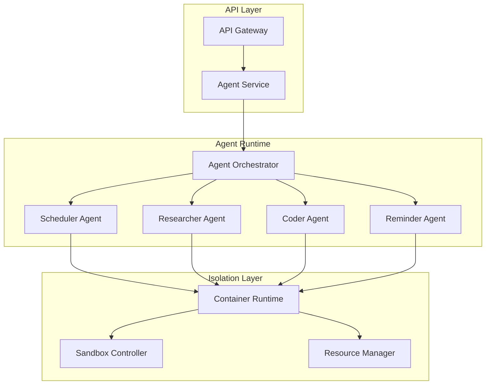
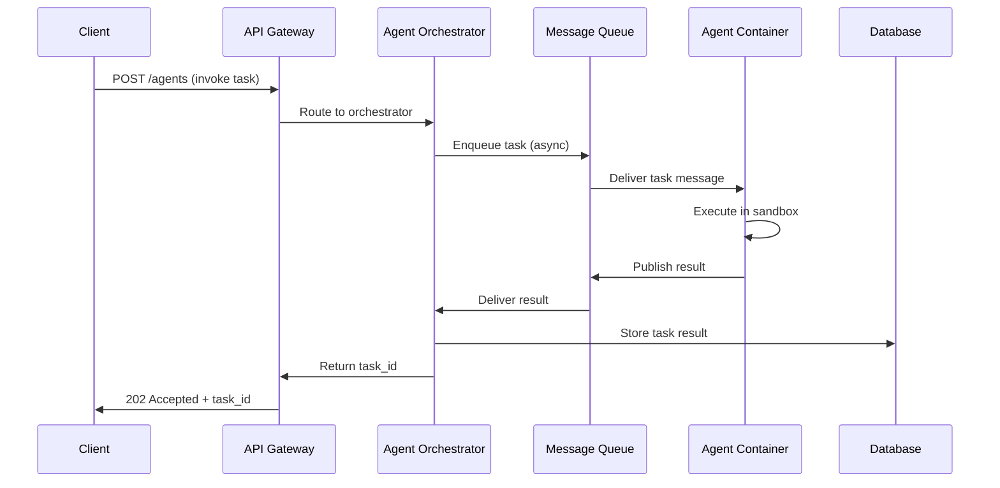
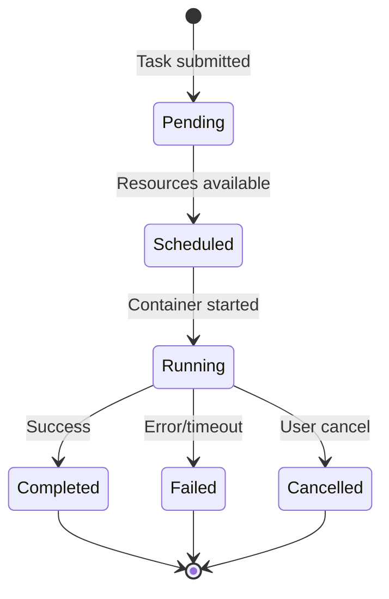

# Agent Delegation

This document describes the technical implementation of agent delegation in
Kimberly, including isolation mechanisms, sandboxing, resource limits, and
communication protocols.

## Overview

Kimberly delegates specialized tasks to agents (Scheduler, Researcher, Coder,
Reminder) to handle complex operations efficiently. Each agent runs in an
isolated environment with defined resource constraints and communicates via
standardized protocols.

## Agent Implementation Architecture

### Execution Model

Agents are implemented as **containerized microservices** running in the
Kubernetes cluster:



### Implementation Approach

| Component | Technology | Purpose |
|-----------|------------|---------|
| Container Runtime | Docker / containerd | Process isolation |
| Orchestration | Kubernetes | Scheduling, scaling, lifecycle |
| Agent Images | OCI containers | Portable, versioned agent code |
| Sandbox | gVisor / Firecracker (optional) | Enhanced isolation for untrusted code |

Each agent:

1. Runs in its own container with a dedicated process namespace
2. Has no shared filesystem with other agents or the host
3. Communicates only via defined APIs (no direct memory access)
4. Is subject to resource quotas enforced by Kubernetes

## Isolation and Sandboxing Mechanisms

### Container Isolation (Default)

All agents run in Docker containers with the following isolation features:

- **Process isolation**: Each agent runs in a separate PID namespace
- **Network isolation**: Agents use Kubernetes network policies to restrict
  egress/ingress
- **Filesystem isolation**: Read-only root filesystem with ephemeral scratch
  volumes
- **User isolation**: Agents run as non-root users with minimal capabilities

### Resource Limits

Resource constraints are enforced via Kubernetes resource specifications:

```yaml
# Example agent pod resource limits
resources:
  requests:
    memory: "256Mi"
    cpu: "250m"
  limits:
    memory: "512Mi"
    cpu: "500m"
    ephemeral-storage: "100Mi"
```

| Resource | Default Limit | Max Allowed | Enforcement |
|----------|--------------|-------------|-------------|
| Memory | 512 Mi | 1 Gi | OOM kill if exceeded |
| CPU | 500m (0.5 cores) | 1 core | CPU throttling |
| Ephemeral storage | 100 Mi | 500 Mi | Pod eviction |
| Execution time | 60 seconds | 300 seconds | Timeout termination |
| Network egress | Rate limited | 1 Mbps | Traffic shaping |

### Enhanced Sandboxing (Optional)

For scenarios requiring stronger isolation (e.g., Coder agent executing
untrusted code), Kimberly supports enhanced sandboxing:

| Technology | Use Case | Trade-off |
|------------|----------|-----------|
| gVisor | Syscall filtering | ~10-20% performance overhead |
| Firecracker | MicroVM isolation | Higher resource overhead, stronger isolation |
| Kata Containers | VM-based containers | Best isolation, highest overhead |

Configuration example for gVisor runtime:

```yaml
# Pod annotation for gVisor
annotations:
  io.kubernetes.cri-o.runtime-handler: "runsc"
```

### Security Policies

Agents are subject to the following security constraints:

1. **Capability dropping**: All Linux capabilities dropped except minimal set
2. **Seccomp profiles**: Restrict system calls to a defined allowlist
3. **AppArmor/SELinux**: Mandatory access control policies
4. **Network policies**: Deny-by-default with explicit allowlists
5. **Secret access**: No direct access to Kubernetes secrets; secrets injected
   at runtime via environment variables

Example Pod Security Policy:

```yaml
securityContext:
  runAsNonRoot: true
  runAsUser: 1000
  readOnlyRootFilesystem: true
  allowPrivilegeEscalation: false
  capabilities:
    drop:
      - ALL
```

## Communication Protocols

### Internal Communication

Agents communicate with the core Kimberly services using the following
protocols:



| Protocol | Use Case | Implementation |
|----------|----------|----------------|
| REST/HTTP | Synchronous API calls | OpenAPI-defined endpoints |
| gRPC | High-performance internal calls | Protobuf schemas |
| Message Queue | Async task dispatch | RabbitMQ / Kafka |
| WebSocket | Real-time status updates | Agent status streaming |

### Message Format

Agent tasks use a standardized message envelope:

```json
{
  "task_id": "task_abc123",
  "agent_id": "researcher",
  "user_id": "user_456",
  "action": "search",
  "params": {
    "query": "best open-source LLMs"
  },
  "context": {
    "conversation_id": "conv_789",
    "memory_refs": ["mem_001", "mem_002"]
  },
  "constraints": {
    "timeout_seconds": 60,
    "max_results": 10
  },
  "created_at": "2025-11-26T04:30:00Z"
}
```

### Response Format

```json
{
  "task_id": "task_abc123",
  "status": "completed",
  "result": {
    "data": { ... },
    "metrics": {
      "execution_time_ms": 1250,
      "tokens_used": 150
    }
  },
  "completed_at": "2025-11-26T04:30:02Z"
}
```

## Agent Orchestration

### Concurrency Limits

To prevent resource exhaustion, Kimberly enforces concurrency limits:

- **Max concurrent agents per user**: 3
- **Global agent pool size**: Configurable based on cluster capacity
- **Queue depth limit**: 100 pending tasks per user

### Lifecycle Management



### Failure Handling

| Failure Type | Detection | Recovery |
|--------------|-----------|----------|
| Container crash | Kubernetes probe | Auto-restart with backoff |
| Timeout | Orchestrator watchdog | Terminate and report failure |
| Resource exhaustion | OOM/CPU metrics | Kill, log, alert |
| Network failure | Health checks | Retry with exponential backoff |

## Agent Capability Model

Each agent has a defined capability profile that restricts its actions:

| Agent | Network Access | File Access | External APIs | Memory Access |
|-------|---------------|-------------|---------------|---------------|
| Scheduler | Calendar APIs only | None | Google Calendar, Outlook | Read user preferences |
| Researcher | Web search APIs | Read-only temp | Search engines | Read context only |
| Coder | None (sandboxed) | Ephemeral only | None | Read context only |
| Reminder | None | None | Notification services | Read/write reminders |

### Deny List

Agents are explicitly blocked from:

- Accessing Kubernetes secrets or service accounts
- Making requests to internal cluster services (except designated APIs)
- Executing privileged operations or syscalls
- Accessing other users' data or memory
- Modifying persistent storage outside designated areas

## Monitoring and Observability

### Metrics

Agent execution is tracked via Prometheus metrics:

- `agent_task_duration_seconds` — Task execution time histogram
- `agent_task_status_total` — Count by status (completed, failed, timeout)
- `agent_resource_usage` — CPU/memory utilization per agent type
- `agent_queue_depth` — Pending tasks in queue

### Logging

All agent activity is logged with:

- Task ID for correlation
- User ID (hashed for privacy)
- Action type and parameters (redacted for sensitive data)
- Execution metrics and errors

### Alerting

| Alert | Condition | Severity |
|-------|-----------|----------|
| Agent failure rate high | >5% failures in 5min window | Warning |
| Agent queue backlog | >50 pending tasks | Warning |
| Agent timeout spike | >10% timeouts | High |
| Resource exhaustion | >90% limit usage | Critical |

## Security Considerations

### Threat Mitigations

| Threat | Mitigation |
|--------|------------|
| Agent escape | Container isolation, gVisor for high-risk agents |
| Data exfiltration | Network policies, egress filtering |
| Resource exhaustion | Strict limits, quota enforcement |
| Privilege escalation | Non-root, dropped capabilities, seccomp |
| Malicious input | Input validation, sandboxed execution |

### Audit Trail

All agent invocations are logged to an immutable audit trail:

```json
{
  "event_type": "agent_invocation",
  "timestamp": "2025-11-26T04:30:00Z",
  "user_id_hash": "sha256:abc...",
  "agent_id": "researcher",
  "task_id": "task_abc123",
  "action": "search",
  "status": "completed",
  "resource_usage": {
    "cpu_seconds": 0.5,
    "memory_mb": 128
  }
}
```

## Configuration

### Environment Variables

| Variable | Description | Default |
|----------|-------------|---------|
| `AGENT_TIMEOUT_SECONDS` | Max execution time per task | 60 |
| `AGENT_MAX_CONCURRENT` | Max concurrent agents per user | 3 |
| `AGENT_MEMORY_LIMIT` | Memory limit per agent | 512Mi |
| `AGENT_CPU_LIMIT` | CPU limit per agent | 500m |
| `AGENT_SANDBOX_ENABLED` | Enable gVisor sandboxing | false |

### Kubernetes ConfigMap

```yaml
apiVersion: v1
kind: ConfigMap
metadata:
  name: agent-config
data:
  timeout_seconds: "60"
  max_concurrent_per_user: "3"
  sandbox_runtime: "runsc"
  deny_list: |
    - internal.cluster.local
    - metadata.google.internal
```

## Related Documents

- [ARCHITECTURE.md](../ARCHITECTURE.md) — System architecture overview
- [INFRASTRUCTURE.md](INFRASTRUCTURE.md) — Deployment and infrastructure
- [SECURITY_AND_RISKS.md](../SECURITY_AND_RISKS.md) — Security policies and
  risk register
- [ROLES_AND_AGENTS.md](ROLES_AND_AGENTS.md) — Agent roles and responsibilities
- [openapi.yaml](openapi.yaml) — Agent API specifications
