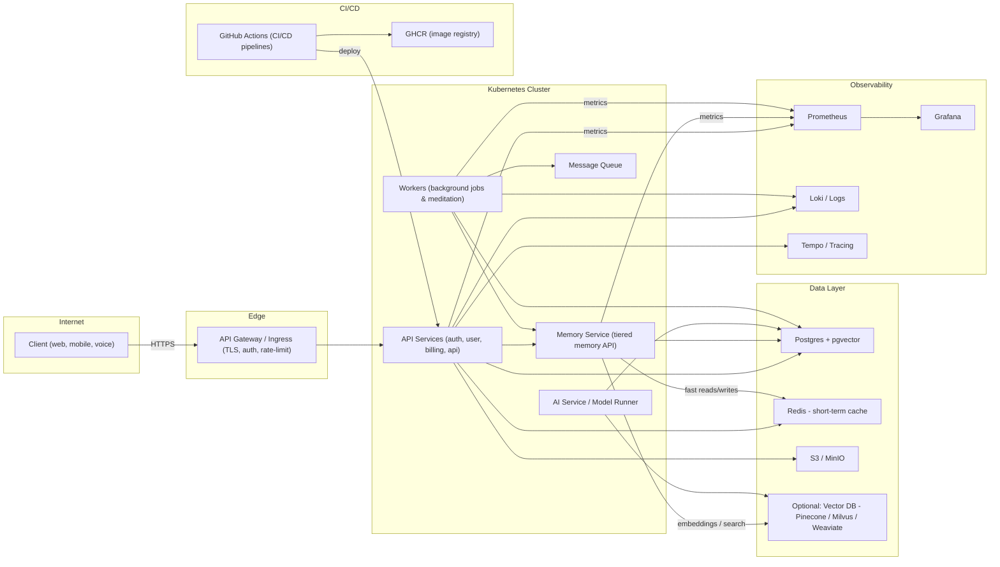
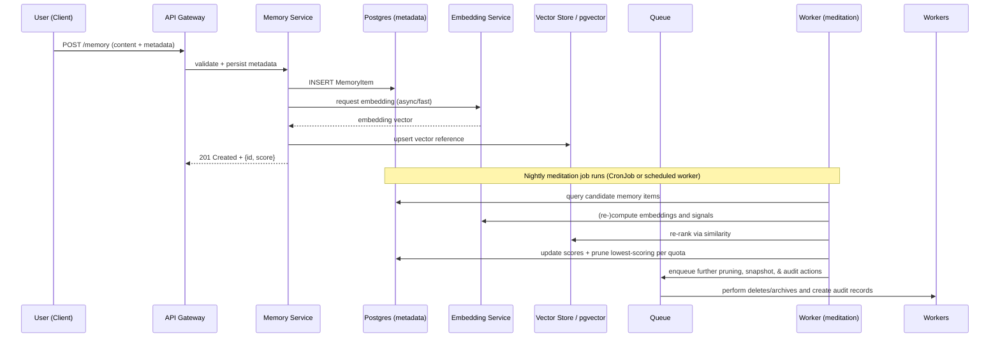

# Infrastructure

## Architecture Diagrams

This file contains two primary diagrams (component and sequence) describing the proposed
infrastructure for Kimberly and the Memory Manager. Use these as a reference for design
discussions and to generate more detailed deployment diagrams.

### Component diagram (high level)



Notes:

- Start with Postgres + pgvector to keep the initial stack free-friendly and simple.
- Redis is used for short-term memory and ultrafast context access.
- Vector store is optional early — add when embedding volume or throughput justifies it.
- Nightly meditation is run by `Workers` (CronJob or scheduled workers) to re-score
items and prune/rotate per quota rules.

### Memory flow — sequence diagram

This sequence shows a common path: store a new memory from chat, how it is
indexed/embedded, and the nightly meditation pruning.



Next steps / additional views ----------------------------

- Add provider-specific topology (Oracle Always Free k3s, Fly.io, AWS/GCP) if you want
physical network, subnets, and managed service diagrams.
- Add deployment views (CI/CD flow, GitHub Actions details) and scaling diagrams
(autoscaler groups, read replicas for Postgres, vector DB cluster topology) on request.

Reference: canonical memory model is `docs/memory-model.md` — use that file as the
single source for memory quotas, lifecycle, and pruning behaviour.

## Infrastructure Design — Memory Manager

Status: Draft

Summary -------

This document lays out an infrastructure design for Kimberly and the Memory Manager with
a strong preference for free / free‑tier hosting. The design supports local development,
low‑cost MVP hosting and a path to production-ready managed services when budgets or
scale demand it.

Goals -----

- Start small: free resources for dev and early users, easy local dev story.
- Portability: portable Terraform + K8s manifests so providers can be swapped.
- Safety & privacy: encryption, audit trails, and user controls built-in.
- Scalability path: clear migrations from self-hosted free VMs to managed cloud
services.

High-level architecture -----------------------

Core components:

- API gateway (ingress + TLS + auth)
- Application services (auth, users, billing, jobs, memory, agents) deployed as
containers on Kubernetes
- Memory subsystem (three-tier design):
  - Short-term: Redis (in-memory cache), extremely low latency, ephemeral
  - Long-term / Permanent: PostgreSQL (metadata + pgvector for small‑scale vectors) or
optional standalone vector store
  - Object store (S3-compatible, e.g., MinIO for self-hosted or provider-managed S3 for
cloud)
- Worker fleet: background processing for jobs and nightly meditation (scoring) —
horizontally scalable workers
- Observability: Prometheus + Grafana for metrics; Loki/ELK+Tempo for logs & traces (OSS
stack)
- CI/CD: GitHub Actions (pipeline: build → tests → publish GHCR images → deploy to
staging → promote to prod)

Network & security ------------------

- Deploy in a VPC/subnet with private services (DBs, Redis) not exposed publicly.
- Use TLS for all ingress and mTLS or service account tokens for in-cluster service-to-
service communication.
- Secrets: use cloud provider KMS or a secrets manager (SOPS/Vault) for dev and
Vault/SSM/KMS in prod.
- RBAC for admin interfaces (agents, memory manager) and explicit consent & audit
logging for all memory writes/deletes.

Storage, retrieval & vector search ---------------------------------

Start (free / simple):

- Postgres with pgvector extension (single instance or managed free-tier Postgres if
available) — keeps storage and vector search in one place, easiest to manage and
migrate.
- Redis for short-term caching and fast session context.
- MinIO as an S3-compatible object store for attachments and transcripts (runs well on
small VMs).

Scale / optional upgrades:

- Swap pgvector to a managed vector DB (Pinecone, Weaviate, Milvus) when vector size or
query throughput outgrows Postgres.
- Introduce replication and read-replicas for Postgres; move large blob storage to
provider-managed object storage (S3) for scale & durability.

Free-first deployment options (recommended order)
------------------------------------------------

1) Local dev — zero cost (recommended to iterate quickly)
   - kind or k3d for Kubernetes local cluster
   - Postgres (pgvector) via Helm chart
   - MinIO Helm chart for S3-like storage
   - Redis via Helm chart
   - Run nightly meditation as a K8s CronJob

   - Oracle Cloud Always Free: small VMs + block storage (run k3s or k0s) — low ops and
truly free for early proof-of-concept
   - Fly.io: if you prefer a simpler managed app platform (uses per-app VMs, easy
deploy, quick setup). ADR already suggests Fly.io. 2) Free-cloud bootstrap (low ops, low
cost):

3) Small managed services (free-tier friendly) for staging:
   - GitHub Actions for CI + GHCR for container registry (already recommended)
   - Managed Postgres free-tier (if available) or small instance on provider's free tier
   - Use MinIO or provider's free object storage tier

Production guidance (when budgets allow) -------------------------------------

- Use managed K8s (EKS/GKE/AKS) for large fleets to reduce ops burden, or a managed
platform (Fly, Render, Railway) with HA if you prefer PaaS.
- Managed Postgres with pgvector or a managed vector DB (Pinecone/Weaviate) when
scale/throughput requires it.
- Backups: regular DB and object store snapshots with cross-region retention and tested
restores.

Operational patterns --------------------

- Nightly meditation pipeline (K8s CronJob or scheduled worker): compute scores for
memory items and run retention policies
- Backup schedule and verification job; keep 30‑90 day backups depending on compliance
- Alerts & SLOs: memory-tier usage, meditation success/failure, vector store latency,
queue backlog, and worker failures
- Cost controls: per-user quotas, throttles, rate-limiting at gateway, and alerts when
approaching quota thresholds

Implementation notes (dev -> staging -> prod)
--------------------------------------------

Dev: run everything in kind/k3d with local ports and a developer secrets file (and
optionally a local Vault) Staging: run on small provider VMs or Fly.io with managed DB
and GHCR Prod: deploy against managed cloud (EKS/GKE/AKS or managed K8s service) with
multi-AZ replicas and a managed vector DB if necessary

Open choices & tradeoffs ------------------------

- pgvector vs dedicated vector DB: pgvector is free/small-scale friendly but less
performant at very large vector sizes. Vector DBs give better performance and features
at cost.
- Self-hosted K8s on free VMs (Oracle Always Free) offers near-zero cost but higher ops
burden vs Fly.io or managed K8s which cost money but lower ops.
- Logging and tracing: ELK/Loki/Tempo are free to run but may be heavy; for small
deployments, use lightweight aggregators and host logs for limited retention.

Next steps ----------

1. Pick target bootstrap environment (local dev + Oracle Always Free or Fly.io).
2. Create a minimal IaC skeleton (Terraform modules + k8s manifests + Helm releases)
that targets the free-first bootstrap.
3. Add CI (GitHub Actions) to build images and deploy to a staging environment.

Reference files in this repo ---------------------------

- `docs/deployment-appendix.md` — existing notes recommending Oracle Always Free and
Fly.io
- `docs/decisions/ADR-0004.md` — deployment model decision in this repo
- `docs/memory-model.md` — canonical memory model we must implement and support

Design owner ------------

Infra / SRE — <infra@kimberly.local> (placeholder)

## Operations and Observability

This document describes pragmatic observability, backup, SLOs, and on-call/runbook
guidance suitable for free-first and small-scale deployments.

### Monitoring & metrics

- Metrics stack (free / OSS friendly): Prometheus + Grafana.
- Metrics to collect:
  - Memory Manager: per-user storage usage per tier, number of memory items, meditation
run durations, items pruned per run
  - Vector store: query latency, QPS, top-K values, cache hit rate (if used)
  - DB: connections, replication lag, long queries
  - Worker queues: queue depth, rate of processing, error rates
  - API gateway: request latencies, 5xx/4xx rates, rate-limiting events

### Logging & tracing

- Stack options (OSS-friendly): Grafana Loki (logs) + Tempo (traces) or an ELK stack.
- Log retention: short defaults for free tier (7–30 days), configurable depending on
requirements and cost.

### Alerting

- Examples (alert if any triggers):
  - Meditation job failure or high latency (> 1 min)
  - Postgres storage > 80% and > 90% (warning + critical)
  - Queue length > N (depends on worker scale) for > 10 minutes
  - Vector search p50/p99 latency > acceptable thresholds
  - Backup job failures

### SLOs & Service targets

- Availability (for the API): 99.9% for paid / production; 99% for small free-tier
deployments
- Memory retrieval latency: p95 < 150ms (pgvector small-scale), improves if using
managed vector DB
- Meditation success rate: daily runs should complete within a configured window (e.g.,
<= 10 minutes)

### Backups & disaster recovery

- Postgres: daily dumps and point-in-time recovery when supported.
- Object store: versioned buckets or snapshot replication to secondary storage.
- Test restores at least monthly; automate restore verifications when possible.

### Runbooks & incident playbooks

This section contains detailed operational playbooks for common issues. Each runbook
includes step-by-step actions, escalation paths, and post-mortem guidance to reduce
Mean Time To Recovery (MTTR).

---

#### Runbook: Memory tier burst overflow

**Severity**: Medium | **SLO Impact**: Data write availability

**Symptoms**:

- Memory-tier quota alarms triggered in Grafana/Prometheus
- Failed POST /memory requests with HTTP 429 or quota error responses
- User complaints about inability to save memories

**Step-by-step actions**:

1. **Identify scope** (5 min)
   - Check Grafana dashboard for affected user(s) and tier(s)
   - Run: `kubectl logs -l app=memory-service --tail=100 | grep quota`
   - Verify which users are hitting limits

2. **Immediate mitigation** (10 min)
   - Temporarily increase quota for affected user(s):

     ```bash
     kubectl exec -it deploy/memory-service -- \
       ./cli quota set --user <user_id> --tier <tier> --limit <new_limit>
     ```

   - If widespread, enable rate limiting at API gateway level

3. **Trigger manual prune** (15 min)
   - Kick off meditation prune for affected user:

     ```bash
     kubectl create job --from=cronjob/meditation meditation-emergency-<user_id>
     ```

   - Monitor job completion in Grafana

4. **Verify recovery** (5 min)
   - Confirm POST /memory requests succeed for affected user(s)
   - Check quota metrics returning to normal levels

**Escalation path**:

| Time elapsed | Action                                      | Contact           |
|--------------|---------------------------------------------|-------------------|
| 0-15 min     | On-call engineer handles                    | PagerDuty primary |
| 15-30 min    | Escalate to Memory Service owner            | @memory-team      |
| 30+ min      | Engage SRE lead + consider user comms       | @sre-lead         |

**Recovery**:

- Run backfill meditation if data was inadvertently purged
- Notify customer if permanent data loss occurred
- Update quota thresholds if this is a recurring pattern

**Post-mortem triggers**:

- Data loss occurred
- Incident duration > 30 minutes
- Multiple users affected simultaneously

---

#### Runbook: Meditation job failed

**Severity**: High | **SLO Impact**: Memory scoring accuracy, retention policy

**Symptoms**:

- CronJob reports failed runs in Kubernetes (kubectl get jobs)
- Prometheus alert: `meditation_job_failed`
- Metrics show unprocessed queued items accumulating
- Memory scores stale (not updated within expected window)

**Step-by-step actions**:

1. **Check job status** (2 min)

   ```bash
   kubectl get jobs -l app=meditation --sort-by=.status.startTime
   kubectl describe job meditation-<timestamp>
   ```

2. **Review logs** (5 min)

   ```bash
   kubectl logs job/meditation-<timestamp> --tail=200
   ```

   - Look for: OOM errors, DB connection failures, timeout errors

3. **Diagnose root cause** (10 min)
   - If OOM: Check resource limits, consider scaling workers
   - If DB error: Verify Postgres connectivity (see DB Outage runbook)
   - If timeout: Check for deadlocks or long-running queries

4. **Restart job** (5 min)

   ```bash
   # Delete failed job and trigger new run
   kubectl delete job meditation-<timestamp>
   kubectl create job --from=cronjob/meditation meditation-manual-$(date +%s)
   ```

5. **Scale workers if needed** (10 min)

   ```bash
   kubectl scale deployment/meditation-workers --replicas=<N>
   ```

6. **Verify success** (5 min)
   - Monitor job completion: `kubectl logs -f job/meditation-manual-<id>`
   - Confirm queue depth returning to normal in Grafana

**Escalation path**:

| Time elapsed | Action                                      | Contact           |
|--------------|---------------------------------------------|-------------------|
| 0-15 min     | On-call engineer handles                    | PagerDuty primary |
| 15-30 min    | Escalate to ML/Backend team                 | @ml-team          |
| 30+ min      | Engage Engineering Lead                     | @eng-lead         |

**Recovery**:

- Re-run meditation job manually and verify sample outputs
- Check that memory scores are updated correctly
- Review and adjust job resource limits if OOM was cause

**Post-mortem triggers**:

- Job failed 3+ times consecutively
- Memory scores not updated for > 24 hours
- Required manual intervention to recover

---

#### Runbook: Database (Postgres) outage

**Severity**: Critical | **SLO Impact**: Full service availability

**Symptoms**:

- Prometheus alert: `postgres_down` or `postgres_connection_errors`
- API returning HTTP 500/503 errors
- All services reporting DB connection failures in logs
- Grafana dashboards showing no data for DB metrics

**Step-by-step actions**:

1. **Confirm outage scope** (2 min)

   ```bash
   # Check Postgres pod status
   kubectl get pods -l app=postgres
   # Check if DB is reachable
   kubectl exec -it deploy/api-service -- pg_isready -h postgres -p 5432
   ```

2. **Check Postgres logs** (5 min)

   ```bash
   kubectl logs -l app=postgres --tail=300
   ```

   - Look for: disk full, OOM killed, replication lag, corruption

3. **Attempt restart if pod crashed** (5 min)

   ```bash
   kubectl delete pod -l app=postgres
   # Wait for pod to restart and become ready
   kubectl wait --for=condition=ready pod -l app=postgres --timeout=120s
   ```

4. **If disk full** (15 min)
   - Expand PVC or clean up old data:

     ```bash
     # Get postgres pod name
     PG_POD=$(kubectl get pods -l app=postgres -o jsonpath='{.items[0].metadata.name}')
     kubectl exec -it $PG_POD -- df -h /var/lib/postgresql/data
     # If managed DB: use provider console to expand storage
     ```

5. **If corruption suspected** (30+ min)
   - Do NOT attempt writes
   - Initiate restore from backup (see Backup & Recovery section)
   - Escalate immediately to DBA/SRE lead

6. **Verify recovery** (10 min)
   - Run health check: `kubectl exec -it deploy/api-service -- ./healthcheck.sh`
   - Confirm API requests succeeding
   - Check replication status if using replicas

**Escalation path**:

| Time elapsed | Action                                      | Contact           |
|--------------|---------------------------------------------|-------------------|
| 0 min        | Page on-call immediately (P1)               | PagerDuty primary |
| 5 min        | Escalate to SRE + DBA                       | @sre-lead, @dba   |
| 15 min       | Notify Engineering Lead + Product           | @eng-lead, @pm    |
| 30 min       | Consider customer communication             | @comms            |

**Recovery**:

- Verify all services reconnect successfully
- Run data integrity checks if corruption was suspected
- Review and update disk alerting thresholds

**Post-mortem triggers**:

- Any production DB outage requires post-mortem
- Data loss or corruption occurred
- Outage duration > 5 minutes

---

#### Runbook: Agent failure

**Severity**: Medium-High | **SLO Impact**: Agent task completion, user experience

**Symptoms**:

- Prometheus alert: `agent_error_rate_high` or `agent_timeout`
- Users reporting tasks not completing or agents not responding
- Agent logs showing repeated errors or timeouts
- Queue buildup for agent tasks

**Step-by-step actions**:

1. **Identify failing agent(s)** (5 min)

   ```bash
   kubectl logs -l app=agent-orchestrator --tail=200 | grep -E "error|failed|timeout"
   # Check which agent types are failing
   kubectl exec -it deploy/agent-orchestrator -- ./cli agent status
   ```

2. **Check agent resource usage** (5 min)

   ```bash
   kubectl top pods -l app=agent-worker
   # Look for OOM or CPU throttling
   ```

3. **Review agent configuration** (5 min)
   - Check for recent config changes
   - Verify external service connectivity (if agent depends on external APIs)

4. **Restart affected agents** (5 min)

   ```bash
   kubectl rollout restart deployment/agent-worker-<type>
   kubectl rollout status deployment/agent-worker-<type>
   ```

5. **If sandbox violation** (10 min)
   - Check agent deny list and capability policies
   - Review agent trace logs for policy violations
   - Temporarily disable affected agent type if needed:

     ```bash
     kubectl exec -it deploy/agent-orchestrator -- ./cli agent disable <type>
     ```

6. **Verify recovery** (5 min)
   - Submit test task and confirm completion
   - Monitor error rates returning to normal

**Escalation path**:

| Time elapsed | Action                                      | Contact           |
|--------------|---------------------------------------------|-------------------|
| 0-15 min     | On-call engineer handles                    | PagerDuty primary |
| 15-30 min    | Escalate to Agent/ML team                   | @agent-team       |
| 30+ min      | Engage Engineering Lead                     | @eng-lead         |

**Recovery**:

- Retry failed tasks if idempotent
- Review and adjust agent resource limits
- Update sandbox policies if legitimate behavior was blocked

**Post-mortem triggers**:

- Agent caused data corruption or unintended side effects
- Sandbox policy violation detected
- User-facing impact > 15 minutes

---

#### Runbook: Vector store degradation

**Severity**: Medium | **SLO Impact**: Search latency, retrieval accuracy

**Symptoms**:

- Prometheus alert: `vector_search_latency_high` (p99 > threshold)
- Users reporting slow or inaccurate search results
- Memory retrieval API latency spikes in Grafana

**Step-by-step actions**:

1. **Check vector store health** (5 min)

   ```bash
   # Get the postgres pod name (handles different deployment types)
   PG_POD=$(kubectl get pods -l app=postgres -o jsonpath='{.items[0].metadata.name}')

   # For pgvector - check table size
   kubectl exec -it $PG_POD -- psql -U postgres -c \
     "SELECT pg_size_pretty(pg_total_relation_size('memory_embeddings'));"

   # Check index status
   kubectl exec -it $PG_POD -- psql -U postgres -c \
     "SELECT * FROM pg_stat_user_indexes WHERE relname = 'memory_embeddings';"
   ```

2. **Review query patterns** (5 min)
   - Check for queries scanning large portions of the index
   - Look for missing or stale embeddings

3. **Rebuild index if needed** (30 min)

   ```bash
   # First, list available indexes to verify the correct name
   kubectl exec -it $PG_POD -- psql -U postgres -c \
     "SELECT indexname FROM pg_indexes WHERE tablename = 'memory_embeddings';"

   # Schedule during low-traffic period and use the correct index name
   kubectl exec -it $PG_POD -- psql -U postgres -c \
     "REINDEX INDEX <index_name> CONCURRENTLY;"
   ```

4. **Scale if capacity issue** (10 min)
   - Increase connection pool size
   - Add read replicas if supported

5. **Verify recovery** (5 min)
   - Run sample queries and check latency
   - Confirm p99 latency returning to normal

**Escalation path**:

| Time elapsed | Action                                      | Contact           |
|--------------|---------------------------------------------|-------------------|
| 0-15 min     | On-call engineer handles                    | PagerDuty primary |
| 15-30 min    | Escalate to Backend/ML team                 | @backend-team     |
| 30+ min      | Consider switching to backup vector store   | @sre-lead         |

**Recovery**:

- Verify search accuracy with sample queries
- Update capacity planning if growth-related

**Post-mortem triggers**:

- Search accuracy degraded below acceptable threshold
- Latency impact > 30 minutes

---

### Escalation matrix

| Severity | Response time | Escalation timeline | Notification channels     |
|----------|---------------|---------------------|---------------------------|
| Critical | 5 min         | Immediate           | PagerDuty, Slack #incident|
| High     | 15 min        | 15 min              | PagerDuty, Slack #ops     |
| Medium   | 30 min        | 30 min              | Slack #ops                |
| Low      | 4 hours       | Next business day   | Email, Slack #ops         |

---

### Post-mortem template

After any significant incident, complete a post-mortem using this template:

```markdown
## Incident Post-Mortem: [Title]

**Date**: YYYY-MM-DD
**Duration**: X hours Y minutes
**Severity**: Critical/High/Medium
**Author**: @handle

### Summary
Brief description of what happened and user impact.

### Timeline
| Time (UTC) | Event                                      |
|------------|-------------------------------------------|
| HH:MM      | Alert triggered                           |
| HH:MM      | On-call acknowledged                      |
| HH:MM      | Root cause identified                     |
| HH:MM      | Mitigation applied                        |
| HH:MM      | Service restored                          |

### Root cause
Detailed explanation of why the incident occurred.

### Impact
- Users affected: N
- Data loss: Yes/No (details)
- SLO impact: X% availability during window

### What went well
- Item 1
- Item 2

### What went poorly
- Item 1
- Item 2

### Action items
| Action                          | Owner    | Due date   | Status |
|---------------------------------|----------|------------|--------|
| Fix root cause                  | @handle  | YYYY-MM-DD | Open   |
| Improve monitoring              | @handle  | YYYY-MM-DD | Open   |
| Update runbook                  | @handle  | YYYY-MM-DD | Open   |

### Lessons learned
Key takeaways to prevent recurrence.
```

---

### Tabletop exercises

Regularly test runbooks via tabletop exercises to validate procedures and identify gaps.

**Exercise schedule**: Quarterly (minimum)

**Exercise format**:

1. **Scenario selection** (5 min)
   - Choose a runbook to test (rotate through all runbooks over time)
   - Define specific failure scenario and constraints

2. **Walkthrough** (30-45 min)
   - Facilitator presents scenario and symptoms
   - On-call team walks through runbook steps verbally
   - Identify any missing steps, unclear instructions, or outdated commands

3. **Tool verification** (15 min)
   - Verify that referenced tools and commands work in staging environment
   - Test access to escalation contacts

4. **Debrief** (15 min)
   - Document gaps found during exercise
   - Create action items to update runbooks
   - Schedule follow-up if significant changes needed

**Sample scenarios**:

| Scenario                        | Runbook to test           | Complexity |
|---------------------------------|---------------------------|------------|
| User reports slow searches      | Vector store degradation  | Low        |
| Meditation hasn't run in 48h    | Meditation job failed     | Medium     |
| All API requests return 500     | Database outage           | High       |
| Agent executing banned actions  | Agent failure             | Medium     |
| Storage alerts firing           | Memory tier burst overflow| Low        |

**Documentation**: After each exercise, update the runbook with any corrections or
improvements identified.

---

### CI/CD & deployment tips

- Use GitHub Actions as CI (repo prefers it) and GHCR for container registry.
- Pipeline stages:
  - unit tests + lint
  - integration tests (in ephemeral kind cluster) — optional
  - build, tag, push image to GHCR
  - deploy to staging and run smoke tests
  - promote to production with an approval step

### Cost controls & lowering ops

- Enforce per-user quotas early to prevent abuse.
- Use pgvector for early workloads to avoid extra managed services cost.
- Keep logs/metrics retention short for free-tier deployments but schedule exports if
required for compliance.

### Next steps & checklist

1. Add Prometheus + Grafana helm charts to the `local` dev stack.
2. Add monitoring exporters (Postgres, Redis, Kubernetes metrics-server) in manifests.
3. Add a GitHub Actions pipeline skeleton for building images and deploying to
dev/staging clusters.

## Deployment Appendix

This appendix summarizes recommended bootstrap options, portability guidance, and local
development tips.

### Bootstrap provider options (short)

- Oracle Cloud Always Free — self-managed VMs (run k3s/k0s): pros — predictable free
tier, full control; cons — more ops work (maintenance, upgrades).
- Fly.io — managed app platform (simpler deployments): pros — fast setup, minimal infra;
cons — not full-featured K8s, potential limits when scaling.

### Portability & migration guardrails

- Keep Terraform, manifests, and Helm charts provider-agnostic where possible.
- Rely on S3-compatible object storage, PostgreSQL, and Redis that can be swapped
between providers.
- Use `ghcr.io` (GitHub Container Registry) for images to avoid cloud-specific
registries.

### Local development tips

- Use `kind` or `k3d` for local Kubernetes clusters and `docker`/`podman` for builds.
- Keep secrets in local dev env files or use a local secrets manager (eg. `sops` with a
test key).
