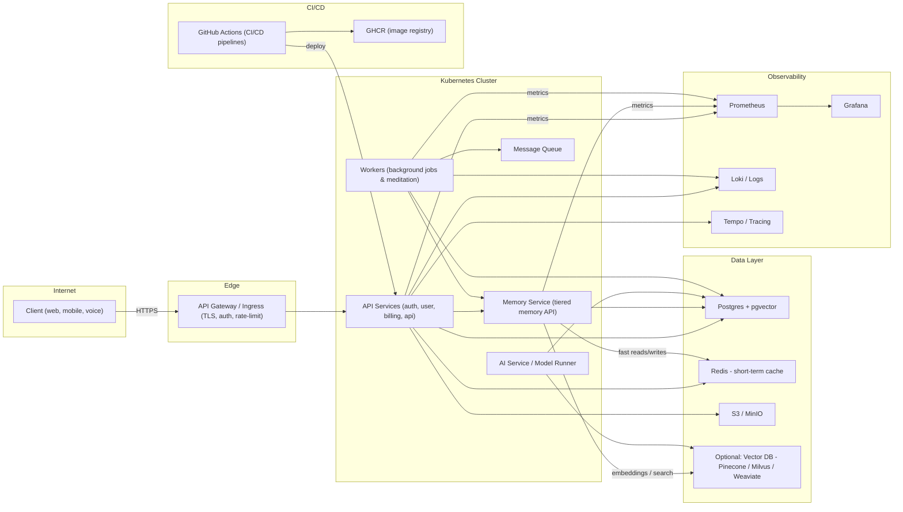
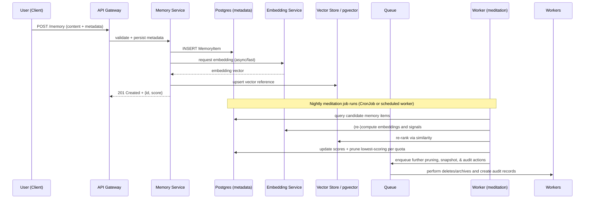

# Infrastructure

## Architecture Diagrams

This file contains two primary diagrams (component and sequence) describing the proposed infrastructure for Kimberly and the Memory Manager. Use these as a reference for design discussions and to generate more detailed deployment diagrams.

### Component diagram (high level)

Notes:
- Start with Postgres + pgvector to keep the initial stack free-friendly and simple.
- Redis is used for short-term memory and ultrafast context access.
- Vector store is optional early — add when embedding volume or throughput justifies it.
- Nightly meditation is run by `Workers` (CronJob or scheduled workers) to re-score items and prune/rotate per quota rules.

### Memory flow — sequence diagram

This sequence shows a common path: store a new memory from chat, how it is indexed/embedded, and the nightly meditation pruning.

Next steps / additional views
----------------------------
- Add provider-specific topology (Oracle Always Free k3s, Fly.io, AWS/GCP) if you want physical network, subnets, and managed service diagrams.
- Add deployment views (CI/CD flow, GitHub Actions details) and scaling diagrams (autoscaler groups, read replicas for Postgres, vector DB cluster topology) on request.

Reference: canonical memory model is `docs/memory-model.md` — use that file as the single source for memory quotas, lifecycle, and pruning behaviour.

## Infrastructure Design — Memory Manager

Status: Draft

Summary
-------
This document lays out an infrastructure design for Kimberly and the Memory Manager with a strong preference for free / free‑tier hosting. The design supports local development, low‑cost MVP hosting and a path to production-ready managed services when budgets or scale demand it.

Goals
-----
- Start small: free resources for dev and early users, easy local dev story.
- Portability: portable Terraform + K8s manifests so providers can be swapped.
- Safety & privacy: encryption, audit trails, and user controls built-in.
- Scalability path: clear migrations from self-hosted free VMs to managed cloud services.

High-level architecture
-----------------------
Core components:
- API gateway (ingress + TLS + auth)
- Application services (auth, users, billing, jobs, memory, agents) deployed as containers on Kubernetes
- Memory subsystem (three-tier design):
  - Short-term: Redis (in-memory cache), extremely low latency, ephemeral
  - Long-term / Permanent: PostgreSQL (metadata + pgvector for small‑scale vectors) or optional standalone vector store
  - Object store (S3-compatible, e.g., MinIO for self-hosted or provider-managed S3 for cloud)
- Worker fleet: background processing for jobs and nightly meditation (scoring) — horizontally scalable workers
- Observability: Prometheus + Grafana for metrics; Loki/ELK+Tempo for logs & traces (OSS stack)
- CI/CD: GitHub Actions (pipeline: build → tests → publish GHCR images → deploy to staging → promote to prod)

Network & security
------------------
- Deploy in a VPC/subnet with private services (DBs, Redis) not exposed publicly.
- Use TLS for all ingress and mTLS or service account tokens for in-cluster service-to-service communication.
- Secrets: use cloud provider KMS or a secrets manager (SOPS/Vault) for dev and Vault/SSM/KMS in prod.
- RBAC for admin interfaces (agents, memory manager) and explicit consent & audit logging for all memory writes/deletes.

Storage, retrieval & vector search
---------------------------------
Start (free / simple):
- Postgres with pgvector extension (single instance or managed free-tier Postgres if available) — keeps storage and vector search in one place, easiest to manage and migrate.
- Redis for short-term caching and fast session context.
- MinIO as an S3-compatible object store for attachments and transcripts (runs well on small VMs).

Scale / optional upgrades:
- Swap pgvector to a managed vector DB (Pinecone, Weaviate, Milvus) when vector size or query throughput outgrows Postgres.
- Introduce replication and read-replicas for Postgres; move large blob storage to provider-managed object storage (S3) for scale & durability.

Free-first deployment options (recommended order)
------------------------------------------------
1) Local dev — zero cost (recommended to iterate quickly)
   - kind or k3d for Kubernetes local cluster
   - Postgres (pgvector) via Helm chart
   - MinIO Helm chart for S3-like storage
   - Redis via Helm chart
   - Run nightly meditation as a K8s CronJob

2) Free-cloud bootstrap (low ops, low cost):
   - Oracle Cloud Always Free: small VMs + block storage (run k3s or k0s) — low ops and truly free for early proof-of-concept
   - Fly.io: if you prefer a simpler managed app platform (uses per-app VMs, easy deploy, quick setup). ADR already suggests Fly.io.

3) Small managed services (free-tier friendly) for staging:
   - GitHub Actions for CI + GHCR for container registry (already recommended)
   - Managed Postgres free-tier (if available) or small instance on provider's free tier
   - Use MinIO or provider's free object storage tier

Production guidance (when budgets allow)
-------------------------------------
- Use managed K8s (EKS/GKE/AKS) for large fleets to reduce ops burden, or a managed platform (Fly, Render, Railway) with HA if you prefer PaaS.
- Managed Postgres with pgvector or a managed vector DB (Pinecone/Weaviate) when scale/throughput requires it.
- Backups: regular DB and object store snapshots with cross-region retention and tested restores.

Operational patterns
--------------------
- Nightly meditation pipeline (K8s CronJob or scheduled worker): compute scores for memory items and run retention policies
- Backup schedule and verification job; keep 30‑90 day backups depending on compliance
- Alerts & SLOs: memory-tier usage, meditation success/failure, vector store latency, queue backlog, and worker failures
- Cost controls: per-user quotas, throttles, rate-limiting at gateway, and alerts when approaching quota thresholds

Implementation notes (dev -> staging -> prod)
--------------------------------------------
Dev: run everything in kind/k3d with local ports and a developer secrets file (and optionally a local Vault)
Staging: run on small provider VMs or Fly.io with managed DB and GHCR
Prod: deploy against managed cloud (EKS/GKE/AKS or managed K8s service) with multi-AZ replicas and a managed vector DB if necessary

Open choices & tradeoffs
------------------------
- pgvector vs dedicated vector DB: pgvector is free/small-scale friendly but less performant at very large vector sizes. Vector DBs give better performance and features at cost.
- Self-hosted K8s on free VMs (Oracle Always Free) offers near-zero cost but higher ops burden vs Fly.io or managed K8s which cost money but lower ops.
- Logging and tracing: ELK/Loki/Tempo are free to run but may be heavy; for small deployments, use lightweight aggregators and host logs for limited retention.

Next steps
----------
1. Pick target bootstrap environment (local dev + Oracle Always Free or Fly.io).
2. Create a minimal IaC skeleton (Terraform modules + k8s manifests + Helm releases) that targets the free-first bootstrap.
3. Add CI (GitHub Actions) to build images and deploy to a staging environment.

Reference files in this repo
---------------------------
- `docs/deployment-appendix.md` — existing notes recommending Oracle Always Free and Fly.io
- `docs/decisions/ADR-0004.md` — deployment model decision in this repo
- `docs/memory-model.md` — canonical memory model we must implement and support

Design owner
------------
Infra / SRE — infra@kimberly.local (placeholder)

## Operations and Observability

This document describes pragmatic observability, backup, SLOs, and on-call/runbook guidance suitable for free-first and small-scale deployments.

### Monitoring & metrics

- Metrics stack (free / OSS friendly): Prometheus + Grafana.
- Metrics to collect:
  - Memory Manager: per-user storage usage per tier, number of memory items, meditation run durations, items pruned per run
  - Vector store: query latency, QPS, top-K values, cache hit rate (if used)
  - DB: connections, replication lag, long queries
  - Worker queues: queue depth, rate of processing, error rates
  - API gateway: request latencies, 5xx/4xx rates, rate-limiting events

### Logging & tracing

- Stack options (OSS-friendly): Grafana Loki (logs) + Tempo (traces) or an ELK stack.
- Log retention: short defaults for free tier (7–30 days), configurable depending on requirements and cost.

### Alerting

- Examples (alert if any triggers):
  - Meditation job failure or high latency (> 1 min)
  - Postgres storage > 80% and > 90% (warning + critical)
  - Queue length > N (depends on worker scale) for > 10 minutes
  - Vector search p50/p99 latency > acceptable thresholds
  - Backup job failures

### SLOs & Service targets

- Availability (for the API): 99.9% for paid / production; 99% for small free-tier deployments
- Memory retrieval latency: p95 < 150ms (pgvector small-scale), tightens if using managed vector DB
- Meditation success rate: daily runs should complete within a configured window (e.g., <= 10 minutes)

### Backups & disaster recovery

- Postgres: daily dumps and point-in-time recovery when supported.
- Object store: versioned buckets or snapshot replication to secondary storage.
- Test restores at least monthly; automate restore verifications when possible.

### Runbooks & incident playbooks

- Runbook: Memory tier burst overflow
  - Symptoms: memory-tier quota alarms, failed POST /memory requests with quota errors
  - Immediate actions: identify offending user(s), throttle or increase quota temporarily, kick off a manual meditation prune for that user
  - Recovery: run a backfill meditation if needed; notify customer if data purged

- Runbook: Meditation job failed
  - Symptoms: CronJob reports failed runs, metrics show unprocessed queued items
  - Immediate actions: check job logs, restart job, scale policymakers (workers), verify DB connectivity
  - Recovery: re-run meditation job manually, check sample outputs for correctness

### CI/CD & deployment tips

- Use GitHub Actions as CI (repo prefers it) and GHCR for container registry.
- Pipeline stages:
  - unit tests + lint
  - integration tests (in ephemeral kind cluster) — optional
  - build, tag, push image to GHCR
  - deploy to staging and run smoke tests
  - promote to production with an approval step

### Cost controls & lowering ops

- Enforce per-user quotas early to prevent abuse.
- Use pgvector for early workloads to avoid extra managed services cost.
- Keep logs/metrics retention short for free-tier deployments but schedule exports if required for compliance.

### Next steps & checklist

1. Add Prometheus + Grafana helm charts to the `local` dev stack.
2. Add monitoring exporters (Postgres, Redis, Kubernetes metrics-server) in manifests.
3. Add a GitHub Actions pipeline skeleton for building images and deploying to dev/staging clusters.

## Deployment Appendix

This appendix summarizes recommended bootstrap options, portability guidance, and local development tips.

### Bootstrap provider options (short)

- Oracle Cloud Always Free — self-managed VMs (run k3s/k0s): pros — predictable free tier, full control; cons — more ops work (maintenance, upgrades).
- Fly.io — managed app platform (simpler deployments): pros — fast setup, minimal infra; cons — not full-featured K8s, potential limits when scaling.

### Portability & migration guardrails

- Keep Terraform, manifests, and Helm charts provider-agnostic where possible.
- Rely on S3-compatible object storage, PostgreSQL, and Redis that can be swapped between providers.
- Use `ghcr.io` (GitHub Container Registry) for images to avoid cloud-specific registries.

### Local development tips

- Use `kind` or `k3d` for local Kubernetes clusters and `docker`/`podman` for builds.
- Keep secrets in local dev env files or use a local secrets manager (eg. `sops` with a test key).
