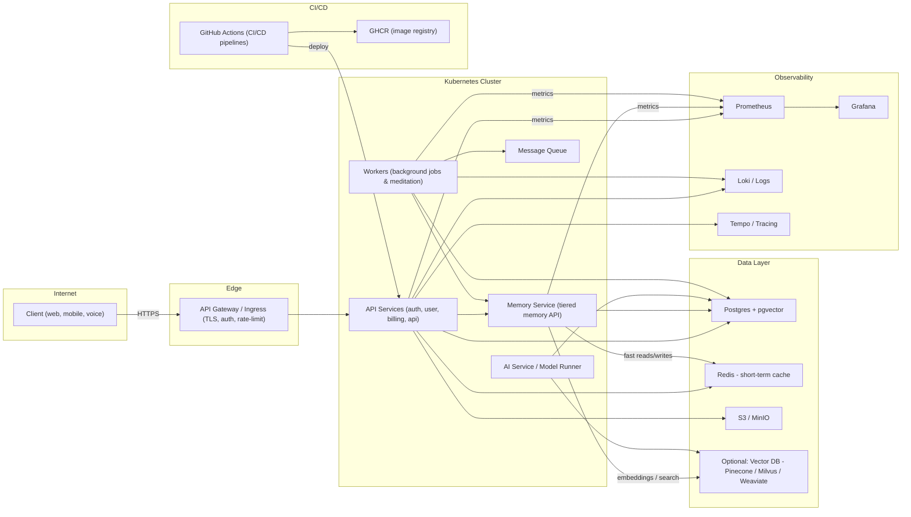
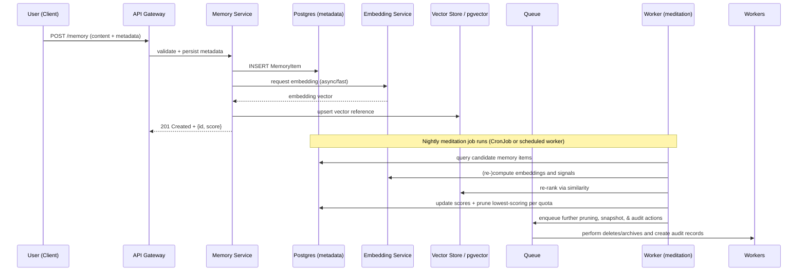

# Architecture diagrams — Kimberly (Memory Manager focused)

This file contains two primary diagrams (component and sequence) describing the proposed infrastructure for Kimberly and the Memory Manager. Use these as a reference for design discussions and to generate more detailed deployment diagrams.

## Component diagram (high level)

Notes:
- Start with Postgres + pgvector to keep the initial stack free-friendly and simple.
- Redis is used for short-term memory and ultrafast context access.
- Vector store is optional early — add when embedding volume or throughput justifies it.
- Nightly meditation is run by `Workers` (CronJob or scheduled workers) to re-score items and prune/rotate per quota rules.

## Memory flow — sequence diagram

This sequence shows a common path: store a new memory from chat, how it is indexed/embedded, and the nightly meditation pruning.

Next steps / additional views
----------------------------
- Add provider-specific topology (Oracle Always Free k3s, Fly.io, AWS/GCP) if you want physical network, subnets, and managed service diagrams.  
- Add deployment views (CI/CD flow, GitHub Actions details) and scaling diagrams (autoscaler groups, read replicas for Postgres, vector DB cluster topology) on request.

Reference: canonical memory model is `docs/memory-model.md` — use that file as the single source for memory quotas, lifecycle, and pruning behaviour.
